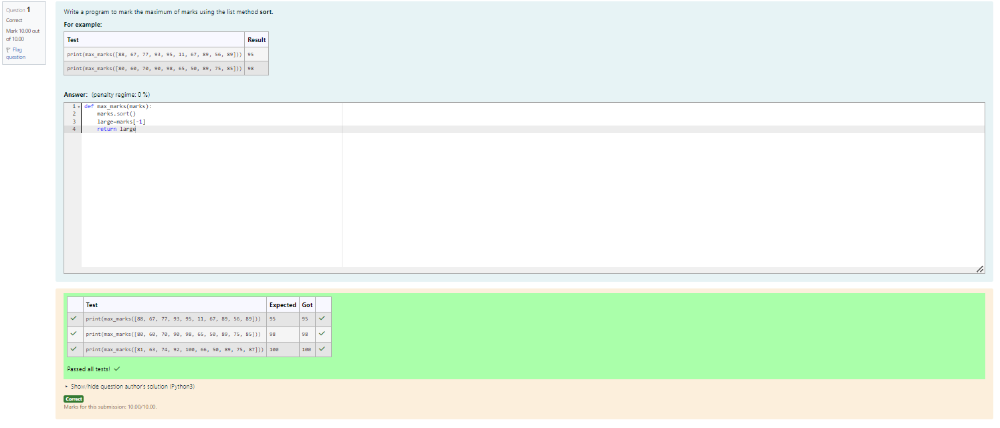
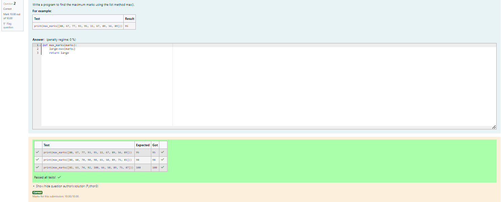

# Find the maximum of a list of numbers
## Aim:
To write a program to find the maximum of a list of numbers.
## Equipment’s required:
1.	Hardware – PCs
2.	Anaconda – Python 3.7 Installation / Moodle-Code Runner
## Algorithm:
1.	Get the list of marks as input
2.	Use the sort() function or max() function or use the for loop to find the maximum mark.
3.	Return the maximum value


NAME ANBU SELVAN S
 
REG NO 212223110003

DEP CSE(IOT)

## Program1:
```
def max_marks(marks):
    marks.sort()
    large=marks[-1]
    return large
```
## Program2:
```
def max_marks(marks):
    large=max(marks)
    return large
```    

## Program3:
```
def max_marks(list1):
    max_num=list1[0]
    for i in list1:
        if i>max_num:
            max_num=i
    return max_num
```


## Output:



## Result:
Thus the program to find the maximum of given numbers from the list is written and verified using python programming.
